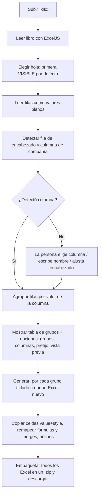

# Divisor de Plan de Compras — Documentación del proyecto

> Documento base (lógico + técnico) del proyecto. Sirve también como **plantilla**
> para documentar otros proyectos internos: la estructura de secciones es genérica,
> solo hay que reemplazar el contenido.

- **Autor / referente:** Ariana Vinzón — S&OP Planner, Supply Chain (Megalabs)
- **Estado:** En producción
- **Herramienta en vivo:** https://segmentacionplcvigente.netlify.app/
- **Repositorio:** `arianavinzon-blip/Discontinuados` — archivo `divisor_plan_compras.html`
- **Última actualización:** septiembre 2026

---

## 1. Resumen ejecutivo

Herramienta interna que **separa automáticamente un Excel (plan de compras, fechas de
entrega, etc.) en un archivo por compañía / país**, conservando el formato original de
cada celda (fechas, moneda, negritas, colores, anchos de columna, celdas combinadas y
fórmulas). Lo que antes se hacía a mano —copiar, pegar, borrar y guardar un archivo por
compañía— ahora sale en segundos.

- **Impacto estimado:** ~60 horas de trabajo manual ahorradas (solo para la división del PLC vigente).
- **Usos:** división del PLC vigente por compañía, facturación de terceros por compañía,
  reporte de fechas de entrega, y en general cualquier Excel que haya que partir por el
  valor de una columna.

---

## 2. Problema / necesidad

El equipo recibe un único Excel consolidado (mismo formato cada mes) y necesita entregar
**un archivo por compañía**. Hacerlo a mano es lento, repetitivo y propenso a errores
(romper formatos, pegar mal, olvidar filas). Además, cada persona maneja archivos con
variaciones: distinta fila de encabezado, distinto nombre de la columna de compañía,
distinta cantidad de columnas, hojas ocultas, totales intercalados, fórmulas, etc.

---

## 3. Solución (qué hace)

La persona sube el Excel; la herramienta detecta la columna de compañía/país, agrupa las
filas por ese valor y **genera un Excel por grupo**, empaquetados en un `.zip`. Todo el
procesamiento ocurre **en el navegador**: ningún archivo se sube a un servidor.

Funciones principales:

- Detección automática de la **hoja** (la primera visible), la **fila de encabezado** y la
  **columna de compañía/país**, con corrección manual si hace falta.
- **Vista previa** de las primeras filas de un grupo antes de generar.
- **Elegir qué grupos generar** (destildar, p. ej., filas de "Total").
- **Sacar columnas** que no se quieren en la salida.
- **Prefijo** configurable para los nombres de archivo.
- Preserva formato, celdas combinadas y **fórmulas con sus referencias reajustadas**.

---

## 4. Lógica de funcionamiento (paso a paso)

**Detalle de la generación (por cada grupo):**

1. Se arma la lista de **columnas conservadas** (según los checkboxes) y un mapa
   `columna original → columna nueva`.
2. Se arma el **mapa de filas** completo (encabezado + filas del grupo) *antes* de copiar,
   porque una fórmula puede referenciar filas que se copian más abajo.
3. Se copia cada celda con `celda.value` **+** `celda.style` (esto es lo que preserva
   fechas, formatos numéricos y estilos).
4. Las **fórmulas** se guardan como fórmula normal (no "compartida") y sus **referencias se
   remapean** a la nueva ubicación de los datos (ej.: `=SUMA(I23:O23)` → `=SUMA(I4:O4)`).
5. Las **celdas combinadas** y los **anchos de columna** se reaplican remapeados a las
   filas/columnas que quedaron.
6. El Excel resultante se agrega al `.zip`.

---

## 5. Arquitectura técnica

| Aspecto | Decisión |
|---|---|
| **Formato** | Un **único archivo HTML** autocontenido (`divisor_plan_compras.html`). |
| **UI** | React 18 (vía CDN) + Babel Standalone (compila el JSX en el navegador). |
| **Lectura/escritura Excel** | [ExcelJS](https://github.com/exceljs/exceljs) 4.4.0 (CDN). |
| **Empaquetado** | [JSZip](https://stuk.github.io/jszip/) 3.10.1 (CDN). |
| **Backend** | **Ninguno.** Todo corre client-side en el navegador. |
| **Hosting** | Netlify (estático) y/o doble clic al archivo local. |

**Por qué un solo HTML y no un build (Vite/webpack):** para que funcione **igual** por
doble clic (archivo suelto) que hosteado. Un build genera módulos que necesitan un
servidor y romperían el modo "doble clic abre en el navegador".

**Dependencia de internet:** las librerías se cargan desde CDN, así que la primera apertura
necesita conexión (aunque el procesamiento del archivo es 100% local).

**Funciones clave del código:**

- `detectHeaderAndColumn(allRows, extraKeyword)` — busca encabezado y columna de compañía
  en las primeras filas (sin acentos ni mayúsculas; lista de sinónimos + nombre custom).
- `loadSheet(wb, idx)` — lee una hoja concreta (filas, encabezado, columna, grupos).
- `computeGroups(...)` — agrupa las filas de datos por el valor de la columna elegida.
- `safeCellValue(srcCell, rowMap, colMap)` — normaliza fórmulas compartidas y remapea refs.
- `remapFormula(formula, rowMap, colMap)` — reescribe referencias A1 a la nueva posición.
- `copyRowInto(srcRow, destRow, keptCols, rowMap, colMap)` — copia una fila value+style.
- `generate()` — arma cada Excel por grupo, remapea merges/anchos y descarga el `.zip`.

---

## 6. Decisiones de diseño clave (el "por qué")

- **Copiar `value` + `style` celda por celda:** es lo que preserva fechas, formatos de
  número y estilos. No se reconstruyen filas desde valores crudos (eso perdería el formato).
- **Fórmulas compartidas → normales:** Excel guarda fórmulas "compartidas" que dependen de
  una celda madre; al separar filas esa madre puede quedar en otro archivo y romper la
  escritura. Se convierten en fórmula independiente.
- **Remapeo de referencias de fórmula:** al mover una fila (ej. de la 23 a la 4), la fórmula
  debe apuntar a la nueva posición. Se remapean filas y columnas según dónde quedaron los datos.
- **Hoja visible por defecto + selector:** algunos libros traen hojas ocultas con datos
  viejos; tomar siempre `worksheets[0]` dividía la hoja equivocada. Ahora se toma la primera
  **visible** y se puede elegir cualquier hoja.
- **Celdas combinadas remapeadas:** se reaplican ajustadas a las filas/columnas que quedaron;
  las que no se pueden reconstruir de forma coherente se omiten sin romper el resto.
- **Sacar columnas / elegir grupos:** flexibilidad por uso (no se guarda), para reutilizar la
  herramienta en otros reportes y descartar totales u columnas que no correspondan.
- **Errores en español, sin jerga:** archivo no válido, vacío, columna vacía, y detalle
  técnico opcional para reportar.

---

## 7. Despliegue y actualización

**Standalone (sin hosting):** doble clic al `.html` → abre en el navegador (necesita internet
la primera vez por las librerías CDN).

**Netlify (recomendado para el equipo):**
1. app.netlify.com → proyecto `segmentacionplcvigente` → **Deploys**.
2. Arrastrar el `.html` nuevo a *"deploy new changes"*.
3. Si pregunta por `index.html` → **Rename and deploy**.
4. El link no cambia. Abrir con **Ctrl + F5** para evitar caché.

**Copia de red:** se mantiene una copia del `.html` y del instructivo (Word) en
`S:\Logistica\Divisor de PLC`. **Al actualizar, reemplazar esa copia también.**

**Control de versiones:** el código se versiona en el repositorio
`arianavinzon-blip/Discontinuados`. La fuente de verdad es el repo + el `.html` publicado.

---

## 8. Mantenimiento, limitaciones y consideraciones

- **Solo `.xlsx`** (no `.xls` ni `.csv`).
- **Fórmulas que referencian una columna que se sacó:** pueden quedar en `#REF!` (igual que
  borrar la columna en Excel). Revisar con "Ver detalle".
- **Encabezados por fórmula con nombres definidos** (ej. `SOP_Heading`): el texto queda
  cacheado; si al recalcular aparece `#NAME?`, conviene copiar el texto en vez de la fórmula.
- **Referencias entre hojas** (`Hoja!A1`): no se remapean (se dejan igual).
- **Windows Mark of the Web:** los `.xlsx` que salen del `.zip` descargado pueden quedar
  bloqueados; se desbloquea el `.zip` en Propiedades → Desbloquear antes de extraer.

---

## 9. Privacidad y seguridad

Todo el procesamiento es **client-side**: el archivo nunca se sube a un servidor. No hay
login ni backend ni almacenamiento entre sesiones. Es información interna que permanece en
la computadora de quien la usa.

---

## 10. Cómo usar este documento como base para otros proyectos

Copiá este archivo y reemplazá el contenido manteniendo las secciones:

1. **Resumen ejecutivo** — qué es y el impacto en una frase.
2. **Problema / necesidad** — qué dolor resuelve.
3. **Solución** — qué hace, funciones principales.
4. **Lógica de funcionamiento** — paso a paso (+ diagrama `mermaid` si ayuda).
5. **Arquitectura técnica** — stack, decisiones de plataforma, funciones clave.
6. **Decisiones de diseño** — el "por qué" de lo importante.
7. **Despliegue y actualización** — cómo se publica y cómo se actualiza.
8. **Mantenimiento y limitaciones** — qué tener en cuenta, casos borde.
9. **Privacidad y seguridad** — dónde vive la información.
10. **Próximas etapas** — qué sigue.

---

## 11. Próximas etapas

- **Facturación de terceros por compañía:** mientras TI local canaliza el requerimiento de
  los reportes, se usa esta herramienta por su agilidad.
- **Reporte de fechas de entrega:** el equipo lo usa también para separar ese reporte.
- **Segunda etapa (fin de año):** automatizar las órdenes de compra de **IBP con AX** a
  través de **MERLIN (Trade)**, vinculando los pedidos de IBP con las órdenes registradas en AX.
